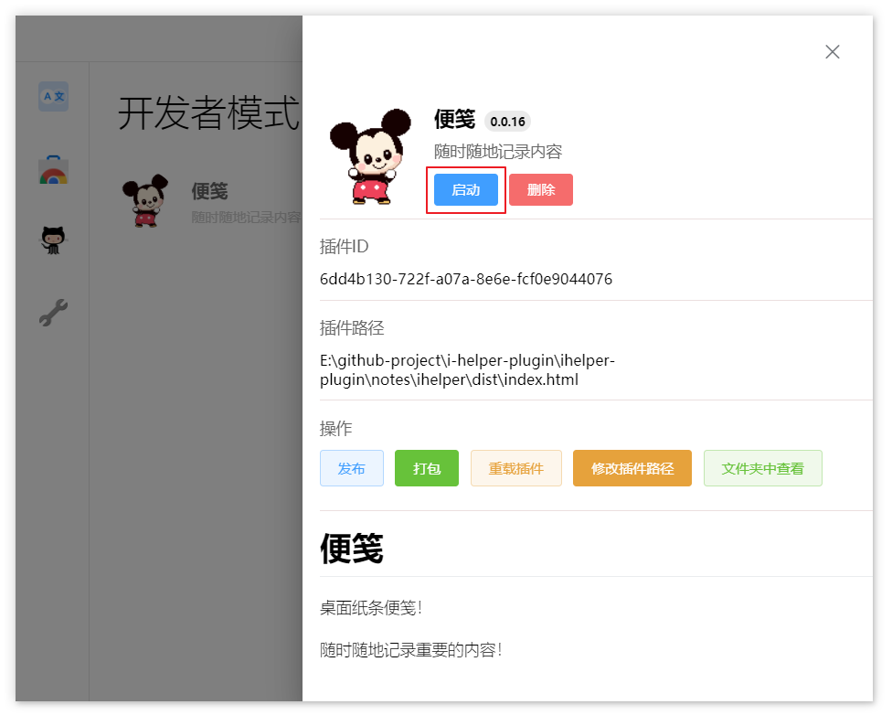
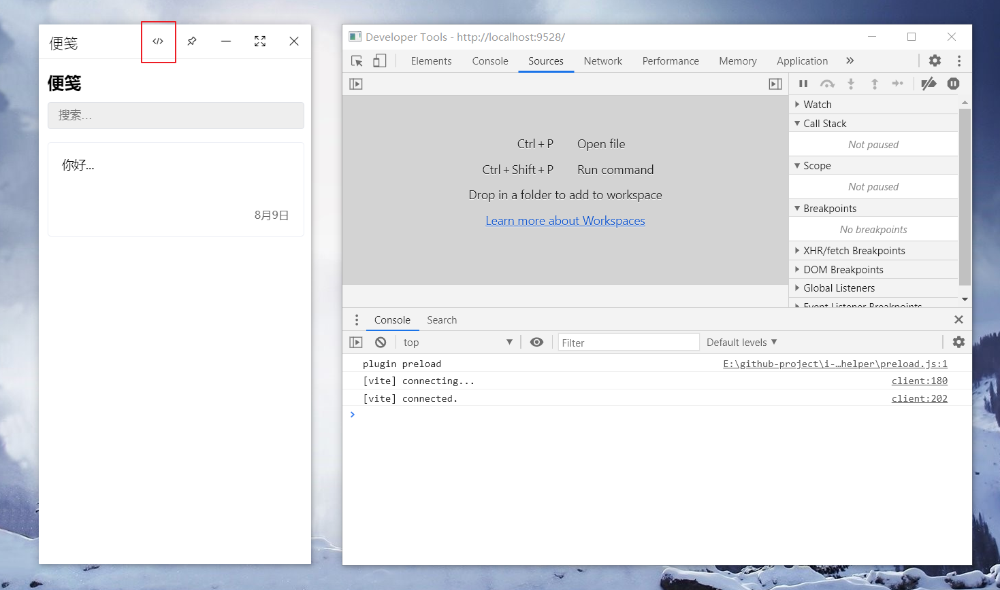
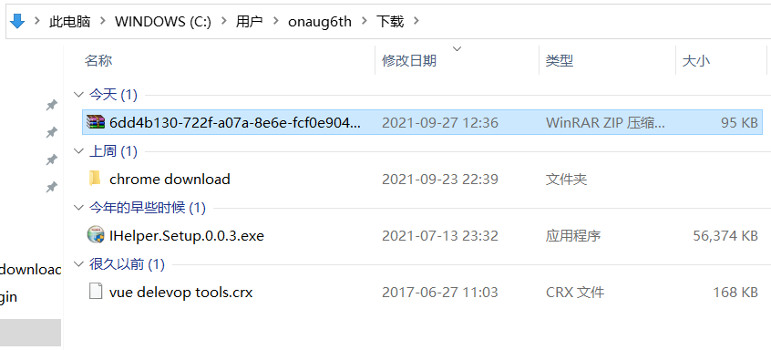
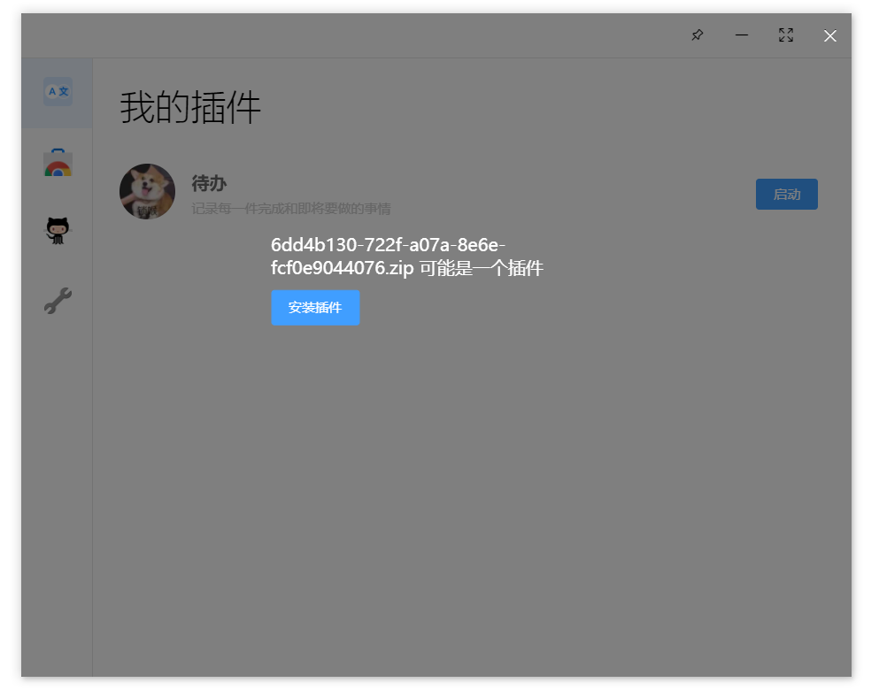
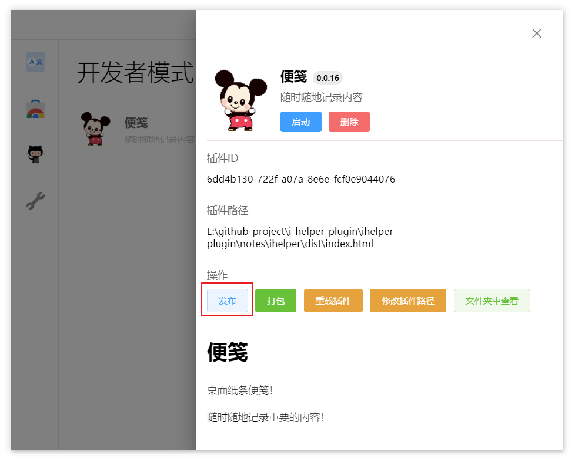
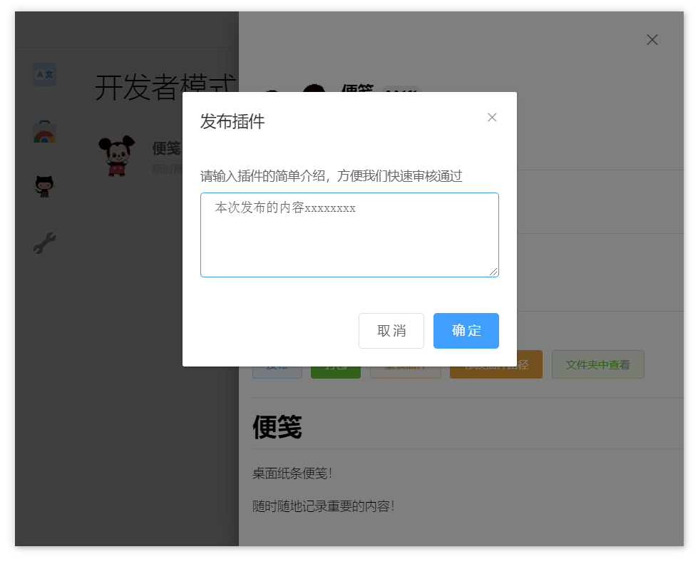

# Write a new plug-in

If you master the skills of web development, developing ihelper plug-ins is very simple!

By configuring a simple configuration file, just write your web project as usual and drag the configuration file into ihelper. You can add a new plug-in. The content and function of the plug-in are entirely up to you.

Ihelper provides rich APIs for plug-ins to write and read data or deal with the operating system.

You can download a plug-in here[demo](https://ihelper-1253668581.cos.ap-nanjing.myqcloud.com/iHelper-plugin.rar), help you quickly start.

Let's start writing a new plug-in!
## Write plug-in configuration

Before developing a new plug-in, we need to write a configuration file `plugin.json` Used to describe the basic information and behavior of the plug-in, and to open certain permissions control.

We write a simple configuration and only need a few necessary configurations.

```json
{
  "name": "my first plugin",
  "version": "0.0.1",
  "logo": "logo.png",
  "desc": "plugin describe",
  "main": "dist/index.html"
}
```

At the same time, we need to prepare the plug-in entry file and logo image in the directory.

```
|——dist
|     |_index.html
|
|——logo.png
|
|-plugin.json
```

After writing the configuration file, drag and drop `plugin.json` into iHelper. The panel for adding plug-ins will appear. Click Add plug-in to add a plug-in.


Like `logo` and `main` value is the path configuration, when looking for the target file. It will search based on the current folder path of `plugin.json`. All configuration information can be found in [Plug-in configuration manual](./plugin-config.md)To view.

## Plug-in developer mode

After successfully adding a plug-in, we can find the plug-in in the **Developer** panel, and click **Start** to run it.



At this time, a new plug-in form will be opened, and the address of the form is the `main` configuration value of `plugin.json`.

When the plug-in is opened in developer mode, the developer tools of the plug-in form will be launched together. You can also display and hide the developer tools through the **switch developer tools** button on the head.



During development, we can set the configuration of the specified development time to avoid frequent modification of the configuration entry file information during plug-in development/release.

```json
{
  "main": "dist/index.html",
  "dev": {
    "main": "http://localhost:9528"
  }
}
```

In this way, when the plug-in is opened in development mode, it will first read the entry address of `dev.main` to open the plug-in address.

Similarly, if you need to verify the functionality of the plug-in file after packaging. You can also set the value of `dev.main` to the file path after packaging.

It should be noted that after each modification of the plug-in configuration. You need to click the **Reload Plugin** button to update the latest configuration information of the plugin

## Call plug-in API

iHelper provides a large number of APIs for the plug-in, which is convenient for the plug-in to interact with the operating system, communicate with other plug-ins, and access the database. There are other more method attributes.

iHelper mounts an api method named `iHelper` to the global object (window) of the plug-in. You can call this method on the page.

```js
// Get the information of the currently logged in user
iHelper.getUser();

// Plug-in database query
iHelper.db.find();
```

All APIs can be consulted in [Plugin API Manual](../../../api/README.md).

## Plug-in packaging

Very happy to be at this moment! Your proud work has been completed. Is preparing to share with others to use.

After the plug-in function is completed, you can pack the plug-in into a compressed package in the form of packaging. And provide this compressed package to others for local installation to use your plug-in.

**Before packaging, it is best to check the configuration file of the plug-in to confirm whether the configuration is correct**

In the **Developer** panel, click the **Package** button. This plug-in can be packaged, after the package is completed. The packaged directory will be automatically opened.




We can drag and drop the plug-in compressed package into iHelper for installation and use.



## Plug-in release

Our plug-in can be used by more people, now we publish the plug-in to the plug-in store! 😀

In the **Developer** panel, click the **Publish** button. You can publish the plug-in to the plug-in store.



Because the publishing plug-in needs to be bound to the user's account, if there is no login account before publishing, the user needs to register and log in.

The registration process is very simple and no information is collected.

The plug-in release needs to be configured with a version number, and the version number must be greater than the version number of the last released version. It’s best to also check the configuration file of the plug-in to confirm whether the configuration is correct

When everything is ready, click the publish button. Fill in the description of this release and submit it. ~~We~~ I will quickly handle the review of the plug-in. After the review is passed, you can see your proud work in the store (•̀ ω • ́ )✧


