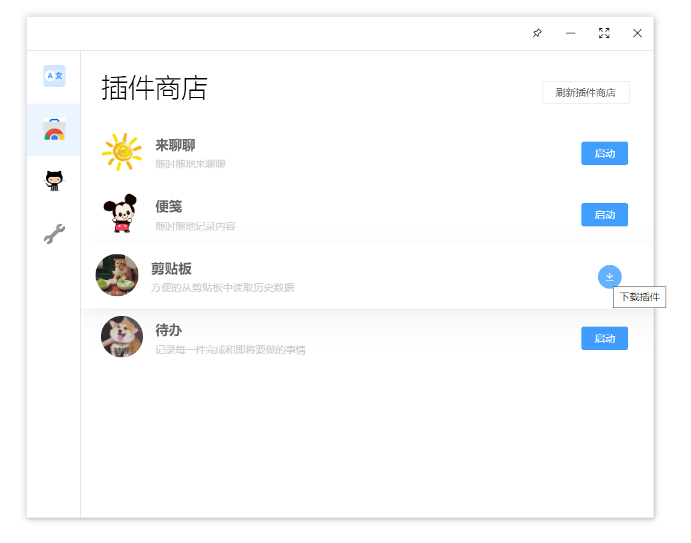

# Instructions for use

## Download/install/update plugin

We can find the plug-in you need in the plug-in store of iHelper and download and install it. After installation, the plug-in can be set and updated.

## Write a new plugin

If you want to write your own plug-in, welcome to read [Write a new plug-in](../advanced/new-plugin.md) to start your own great idea.

## Application Settings/Account Settings

You can perform simple application settings and application update operations in the settings.

