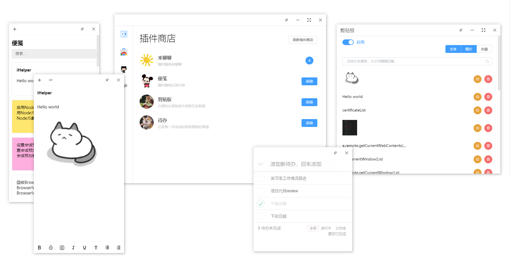

# 介绍

i-helper是一个包含便利插件工具的桌面应用，你可以安装你所需要的插件工具。同时也可以自行开发一款插件并且发布到插件商店中，让其他人一起使用你的作品。

### 开发背景

某一天，我在不同项目之间来回复制代码。频繁切换编辑器让我倍感繁琐，我在想：“要是能写一个工具，将所有内容复制起来，然后再一个个拷出来就方便多了。”

这个时候同事来到了我的旁边，看到我电脑桌面的便笺工具写满了密密麻麻的工作事项。表示也想用一个，让我帮他打开。结果发现他电脑上没有win10的便笺工具。

二话不说，马上就用`electron`写了一个简单的桌面应用，名为`iHelper`，里面包含了几个小功能：便笺，剪贴板记录，待办事项...。

`iHelper`完成了之后发给同事们使用，这个时候T同事突然说了一句。“我也想写点东西，可以加在你的iHelper里面吗？”

那当然可以啊。正当我准备把同事加到仓库开发者成员里时，我又想到：**“如果iHelper能支持运行别人的web项目，像微信小程序那样。是不是就能让更多的前端同事参与进来，增加自己想要的轮子~~工具~~呢”**

于是琢磨一番，继续研究，改成了一个支持下载安装的插件平台。并记录分享其中的过程。

### 平台支持

|  | |  |
| --------- | --------- | --------- |
| windows | mac| linux（暂未开发）

~~暂时找不到图标，先拿这个代替~~
