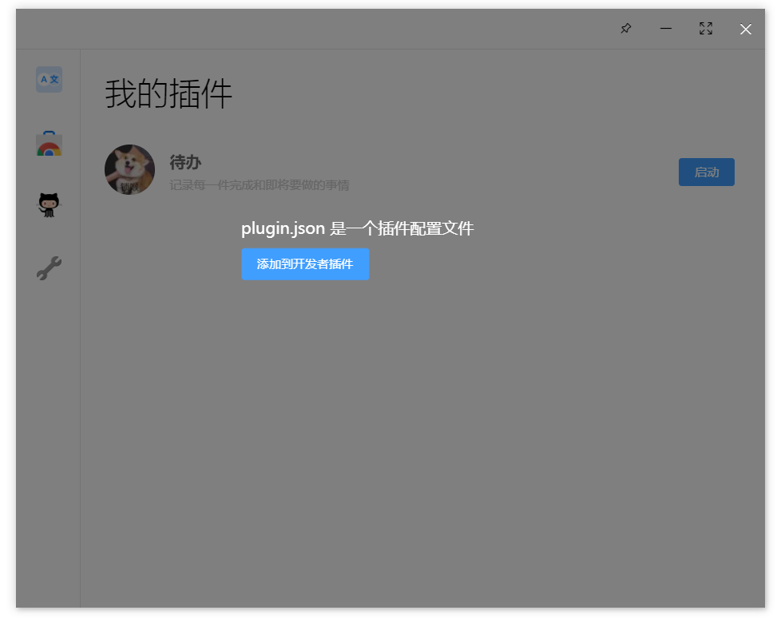
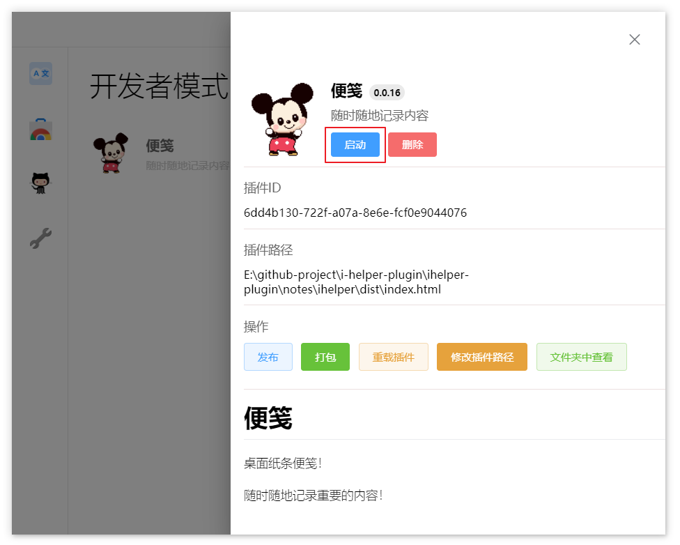
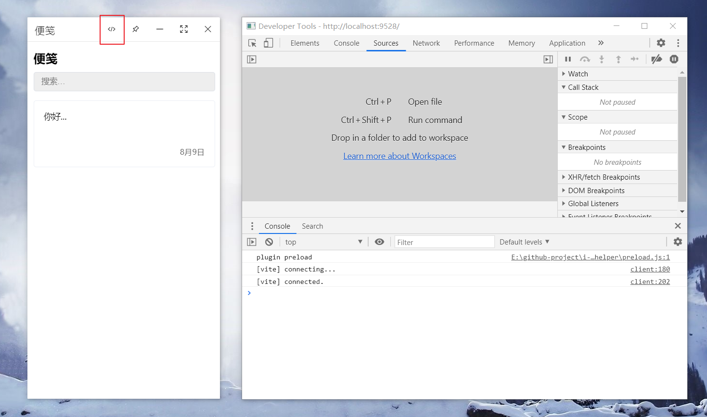
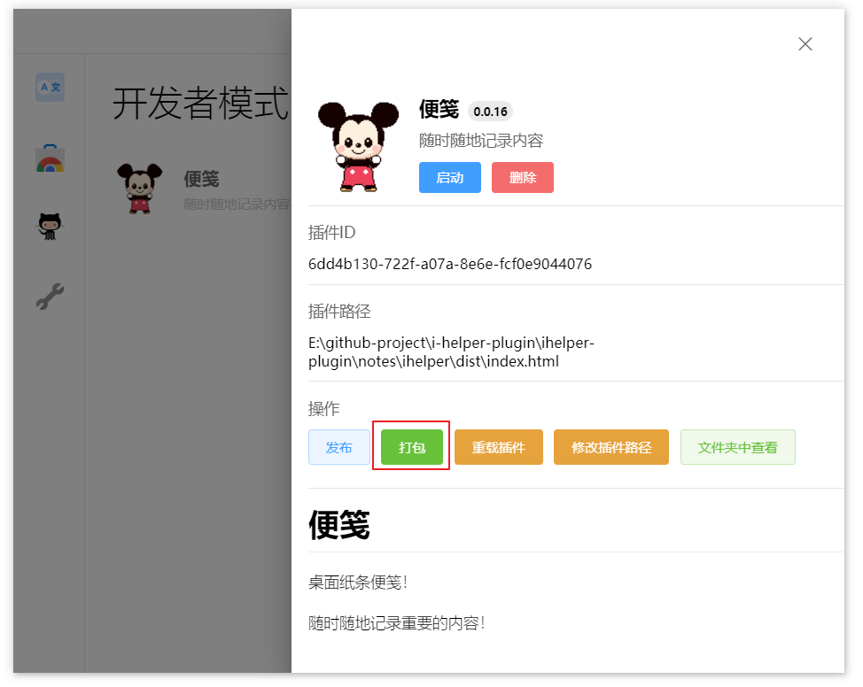
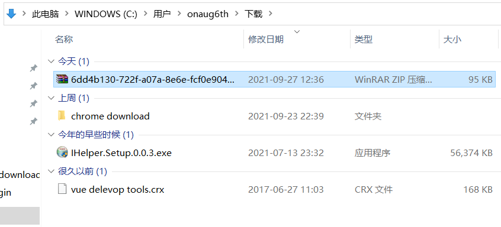
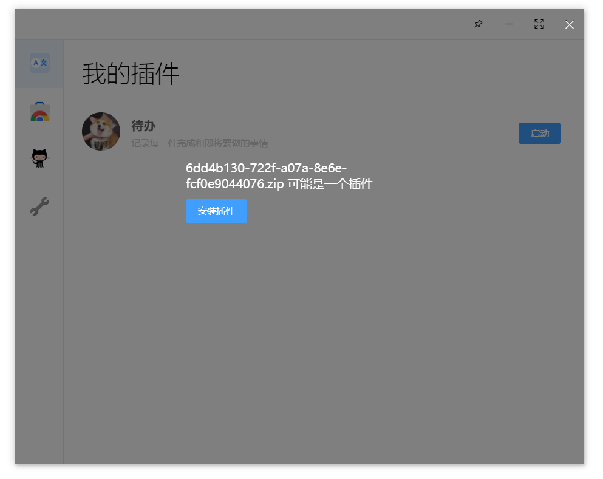
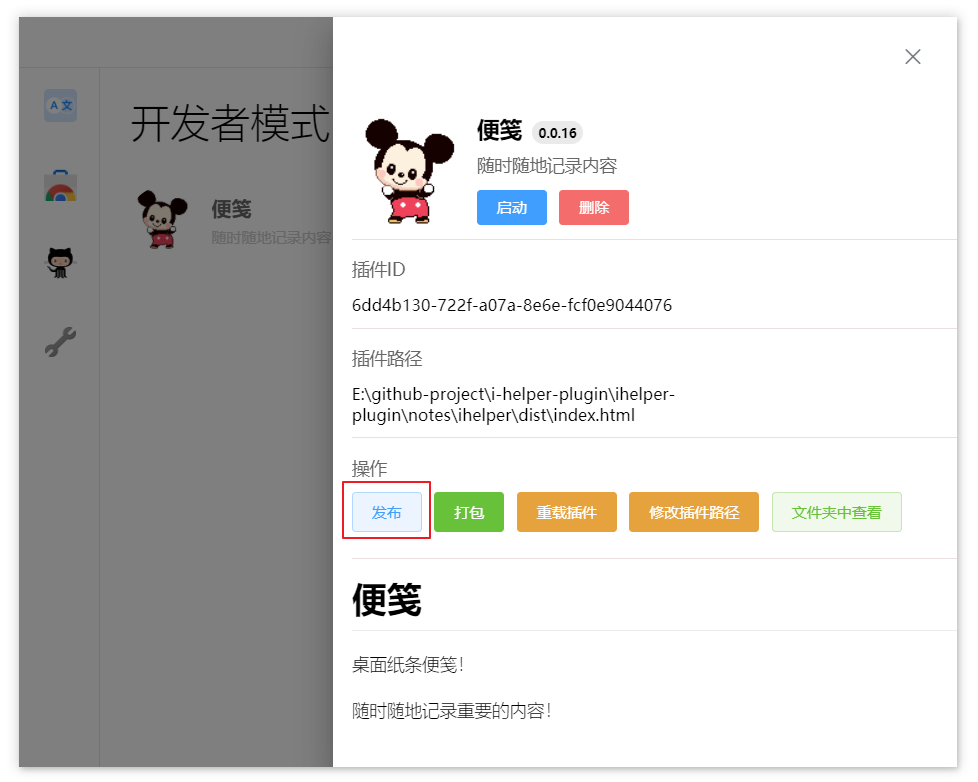
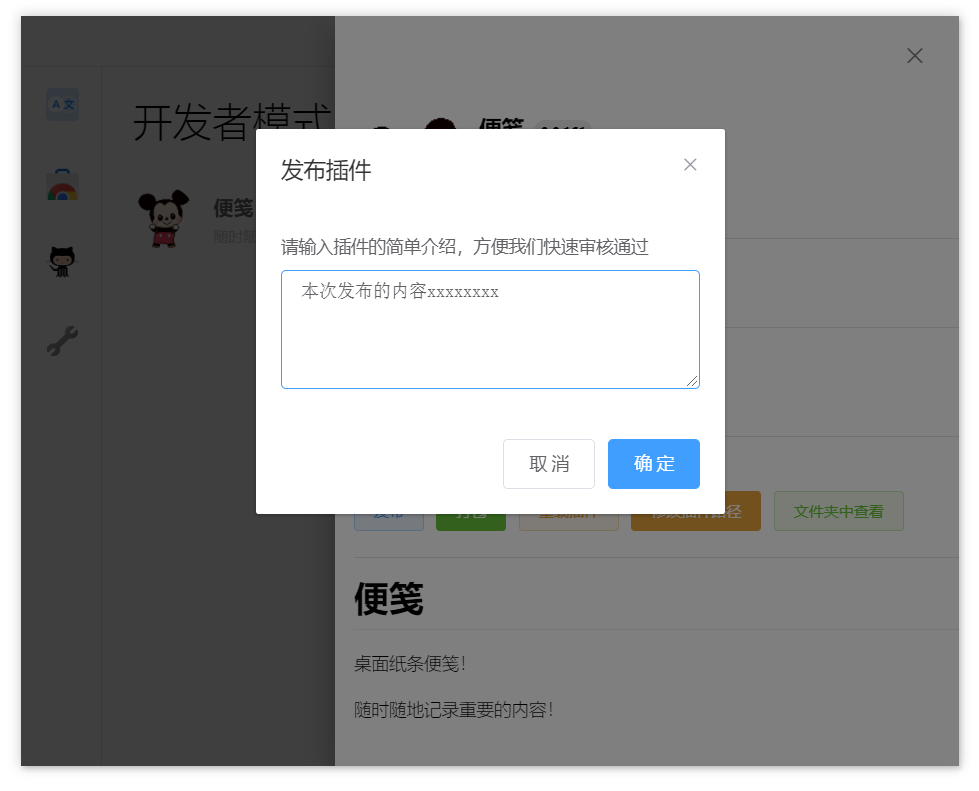

# 编写新的插件

如果你掌握了web开发的技能，开发iHelper的插件非常简单！

通过配置简单的配置文件，只需像往常一样编写你的web项目，将配置文件拖拽到iHelper中。就能添加一个新的插件，插件的内容和功能完全由你来决定。

iHelper提供了丰富的API，方便插件进行数据的写入读取或与操作系统打交道。

这里可以下载一个插件的[demo](https://ihelper-1253668581.cos.ap-nanjing.myqcloud.com/iHelper-plugin.rar)，方便你快速开始。

让我们开始编写一个新的插件吧！

## 编写插件的配置

在开发一个新插件前，我们需要编写一份配置文件 `plugin.json` 用于描述插件的基本信息与行为，和开放某些权限控制。

我们编写一份简单的配置，只需要几个必要的配置就可以了。

```json
{
  "name": "我的第一个插件",
  "version": "0.0.1",
  "logo": "logo.png",
  "desc": "插件的描述",
  "main": "dist/index.html"
}
```

同时我们需要在目录中准备插件的入口文件，logo图片。

```
|——dist
|     |_index.html
|
|——logo.png
|
|-plugin.json
```

编写好配置文件后，将`plugin.json`拖拽到iHelper中。就会出现添加插件的面板。点击添加插件，即可新增插件。




像`logo` 和 `main` 值为路径的配置，在寻找目标文件时。会基于`plugin.json`的当前文件夹路径进行寻找。所有的配置信息我们都能在 [插件配置手册](./plugin-config.md)中进行查看。

##  插件开发者模式

在新增插件成功后，我们可以在**开发者**面板中找到这个插件，并且点击**启动**来运行他。



此时会打开新的插件窗体，窗体的地址为`plugin.json`的`main`配置值。

在插件以开发者模式打开时，会一起启动插件窗体的开发者工具。也可以通过头部的**切换开发者工具**按钮来进行开发者工具的显示隐藏。



在开发时，我们可以设置指定开发时的配置，避免在插件开发/发布时频繁修改配置的入口文件信息。

```json
{
  "main": "dist/index.html",
  "dev": {
    "main": "http://localhost:9528"
  }
}
```

这样插件在开发模式打开时，会优先读取`dev.main`的入口地址来打开插件地址。

同样的，如果你需要验证打包后插件文件功能。也可以设置`dev.main`值为`打包后的文件路径`。

需要注意的是，每次修改了插件配置后。需要点击**重载插件**按钮来更新插件最新的配置信息

##  调用插件API

iHelper给插件提供了大量的api，方便插件与操作系统打交道、与其他插件进行通信、存取数据库。还有其他更多的方法属性。

iHelper往插件的全局对象（window）中，挂载了名为`iHelper`的api方法。你可以在页面中调用此方法。

```js
//  获取当前登录用户信息
iHelper.getUser();

//  插件数据库查询
iHelper.db.find();
```

所有的api都能在[插件API手册](../../api/README.md)中进行查阅。

##  插件打包

很高兴来到这一刻！你的得意作品已经完成了。正准备分享给其他人一起使用。

在插件功能完成后，你可以通过打包的形式将插件打包成压缩包。并且将此压缩包提供给其他人进行本地安装，来使用你的插件。

**在打包前，最好先检查一下插件的配置文件，确认各项配置是否正确**

在**开发者**面板中，点击**打包**按钮。即可将此插件进行打包，打包完成后。会自动打开打包后的目录。





我们可以将插件压缩包拖拽到iHelper中，进行安装使用。



##  插件发布

我们的插件可以给更多人一起使用，现在我们将插件发布到插件商店中！😀

在**开发者**面板中，点击**发布**按钮。即可将插件发布到插件商店中。



因为发布插件需要与用户的账户进行绑定，如果发布前没有登录账号，需要用户注册并登录。

注册过程非常简单，不会收集任何信息。

插件发布需要配置版本号，并且版本号要大于上一个发布版本的版本号。最好也检查一下插件的配置文件，确认各项配置是否正确。

一切就绪，点击发布按钮。填写本次发布的描述内容并提交。~~我们~~我会迅速的处理插件的审核，审核通过后在商店就可以看到你的得意之作了( •̀ ω •́ )✧


