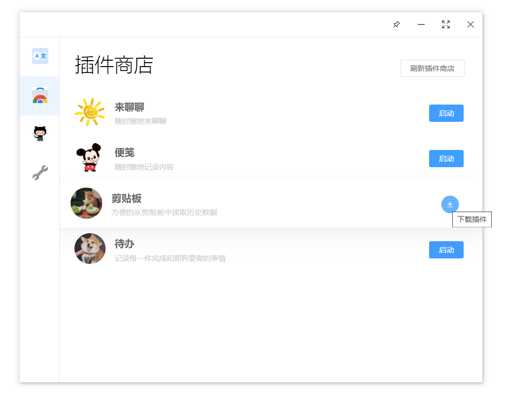
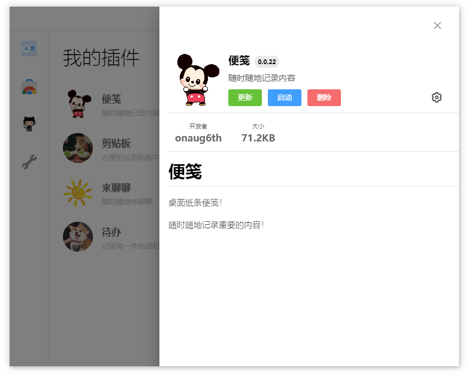
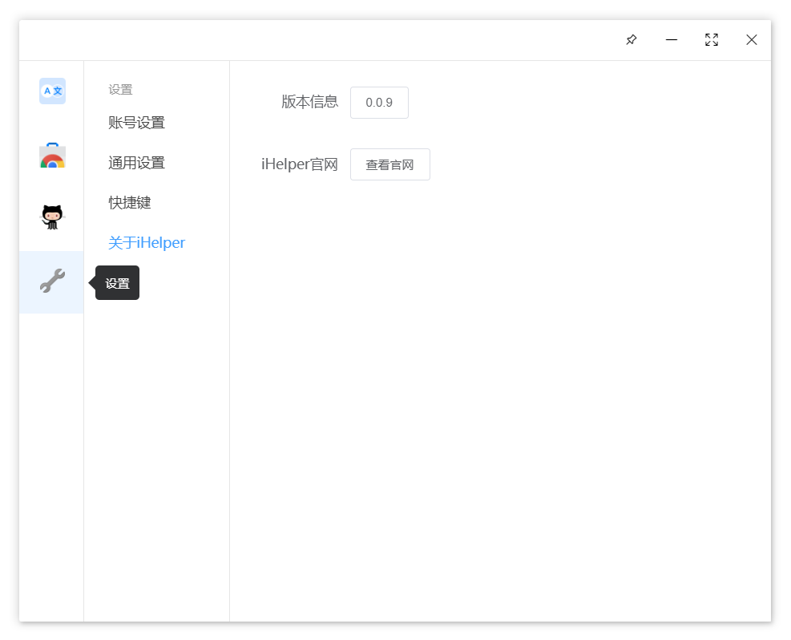

# 使用说明

##  下载/安装/更新插件

我们可以在iHelper的插件商店中找到你需要的插件并进行下载安装，安装后可对插件进行设置与更新操作。

##  编写新的插件

如果你想编写一个属于自己的插件，欢迎阅读[编写新插件](../advanced/new-plugin.md)来开始自己的绝佳创意。

##  应用设置/账号设置

你可以在设置中进行应用的简单设置，与应用更新操作。

